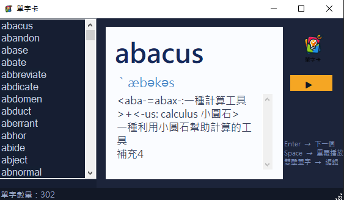

# WordCards
### 專案簡介
本專案開發了一款具備單字資料讀取與互動學習功能的單字卡程式。本系統不僅支援 TSV 格式單字檔的自動載入，還內建了「單字卡翻閱機制」與「Windows Media Player 發音串流核心」，能主動解析音標、解釋與音檔路徑，確保使用者在瀏覽、學習與複習英文單字時，擁有安全、直覺且穩定的操作體驗。

### 使用者畫面

### 執行說明書與結果判讀

#### 操作流程說明
請依序執行以下步驟進行單字學習操作：

1. **啟動程式**：程式啟動後會自動讀取同目錄下的 `WordCards.txt`，並將所有單字載入左側單字清單。
2. **點選單字**：在左側清單中點選任一單字，右側卡片區會立即顯示該單字的音標與解釋，並自動播放發音。
3. **鍵盤翻閱**：按下 `Enter` 切換至下一個單字並播放發音；按下 `Space` 重複播放目前單字的發音。
4. **自動播放模式**：點擊「▶ Play」按鈕啟動自動播放，程式會每隔 2 秒自動切換至下一個單字並發音；再次點擊「■ Stop」即可暫停。
5. **編輯單字**：雙擊左側清單中的任一單字，可開啟編輯視窗修改音標、音檔路徑與解釋，儲存後自動寫回 `WordCards.txt`。

#### 功能按鈕與互動操作

* **▶ Play / ■ Stop 按鈕**：切換自動播放狀態，啟動後每 2 秒自動播放下一個單字。
* **左側單字清單**：列出所有已載入的單字，點擊即可顯示並播放；雙擊進入編輯模式。
* **右側單字卡片區**：
  * **上方大字**：顯示當前單字（深藍粗體）。
  * **琥珀金分隔線**：視覺區隔單字與音標。
  * **音標列**：顯示 IPA 音標（藍色）。
  * **解釋區**：顯示字根拆解與中文說明，支援捲軸瀏覽。
* **右下角提示文字**：提示鍵盤快捷鍵操作說明。

#### 異常輸入與錯誤防治機制
為避免程式因檔案缺失、音檔遺失或索引超出範圍崩潰，系統設有以下攔截警告：

1. **單字檔遺失處理**
   * 異常狀況：程式啟動時找不到 `WordCards.txt`。
   * 系統處理：利用 `File.Exists()` 在讀取前進行檢查，若檔案不存在則彈出「找不到單字檔」錯誤視窗並安全結束程式，防止後續空指標存取崩潰。

2. **音效檔遺失處理**
   * 異常狀況：單字對應的 `.mp3` 音檔不存在或路徑有誤。
   * 系統處理：在 `PlayWord()` 中以 `File.Exists()` 檢查音檔路徑，若音檔遺失則在狀態列顯示「找無 XXX 音效檔」提示，不會強制播放或崩潰。

3. **空選取與取消操作處理**
   * 異常狀況：使用者在清單無選取項目時觸發播放。
   * 系統處理：`PlaySelectedWord()` 會先判斷 `lstWordList.SelectedItem != null`，確認有選取項目後才執行顯示與播放，防止因 Null 參照導致程式崩潰。

4. **自動播放中途點擊處理**
   * 異常狀況：自動播放進行中，使用者直接點擊清單切換單字。
   * 系統處理：`lstWordList_Click` 事件會先偵測 `isPlay` 狀態，若正在自動播放則先呼叫 `btnAutoPlay.PerformClick()` 停止計時器，再執行手動選取，避免雙重播放衝突。

5. **編輯視窗儲存回寫**
   * 異常狀況：編輯後未正確回傳儲存結果，導致資料未寫入檔案。
   * 系統處理：編輯視窗的「儲存」按鈕設定 `DialogResult = Yes`，主視窗以 `ShowDialog()` 回傳值判斷是否確認儲存，確認後才呼叫 `_WordList.SaveToFile()` 寫回 `WordCards.txt`，防止誤操作覆蓋資料。
